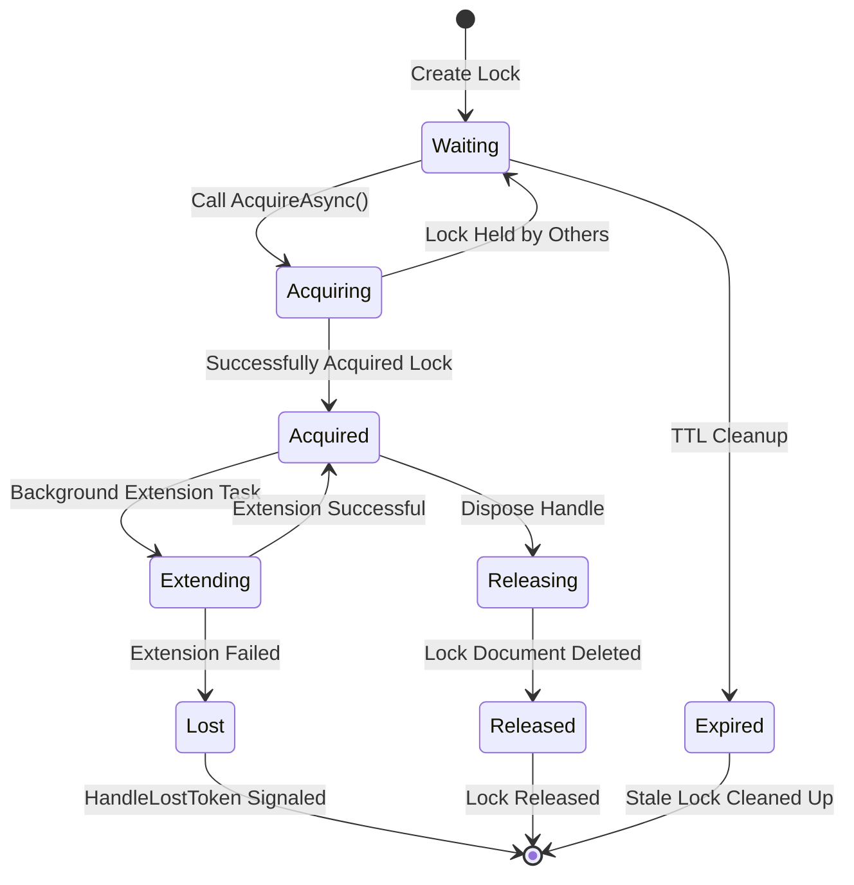
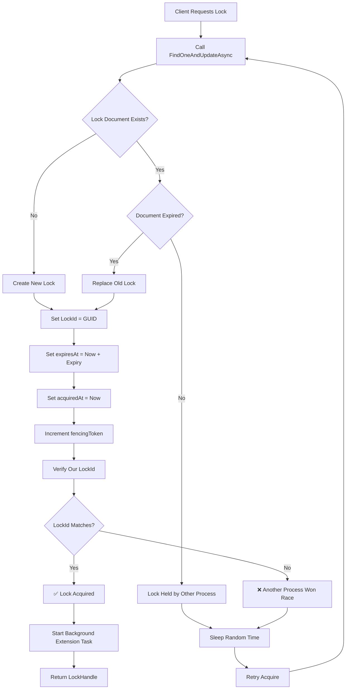
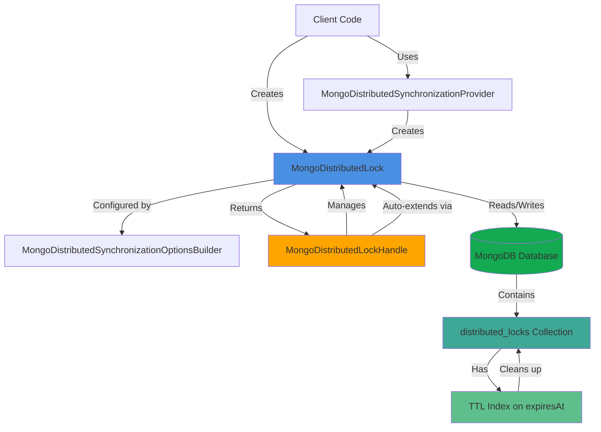
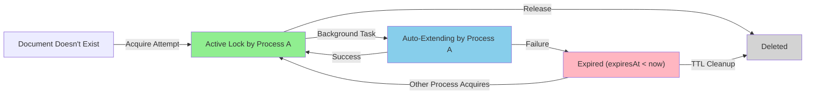
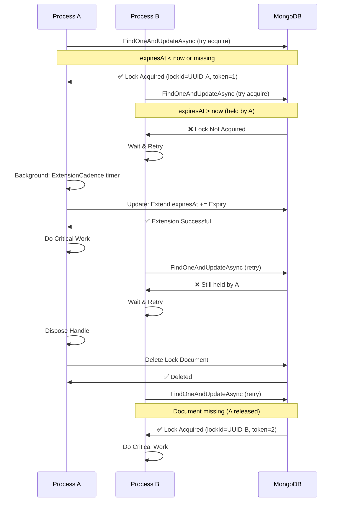
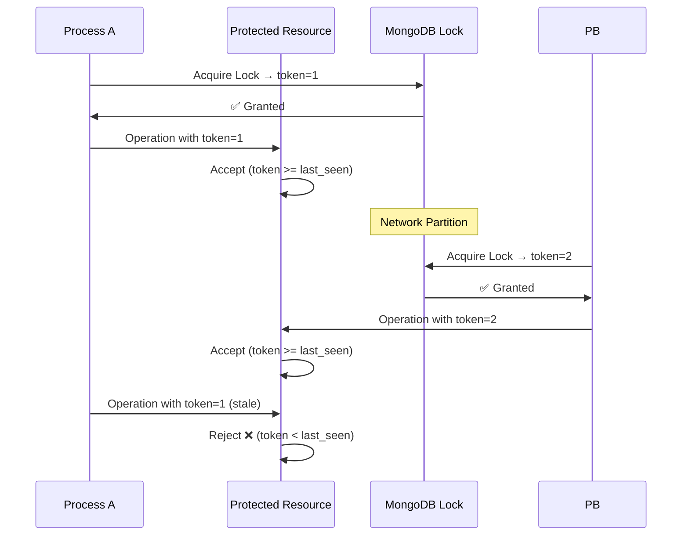

# DistributedLock.MongoDB

[Download the NuGet package](https://www.nuget.org/packages/DistributedLock.MongoDB) [](https://www.nuget.org/packages/DistributedLock.MongoDB/)

The DistributedLock.MongoDB package offers distributed locks based on [MongoDB](https://www.mongodb.com/). For example:

```C#
var client = new MongoClient("mongodb://localhost:27017");
var database = client.GetDatabase("myDatabase");
var @lock = new MongoDistributedLock("myLockName", database);
await using (await @lock.AcquireAsync())
{
    // I have the lock
}
```

## APIs

- The `MongoDistributedLock` class implements the `IDistributedLock` interface.
- The `MongoDistributedSynchronizationProvider` class implements the `IDistributedLockProvider` interface.

## Implementation notes

MongoDB-based locks use MongoDB's document upsert and update operations to implement distributed locking. The implementation works as follows:

1. **Acquisition**: Attempts to insert or update a document with the lock key and a unique lock ID.
2. **Extension**: Automatically extends the lock expiry while held to prevent timeout.
3. **Release**: Deletes the lock document when disposed.
4. **Expiry**: Locks automatically expire if not extended, allowing recovery from crashed processes.

MongoDB locks can be constructed with an `IMongoDatabase` and an optional collection name. If no collection name is specified, locks will be stored in a collection named `"distributed.locks"`. The collection will automatically have an index created on the `expiresAt` field for efficient queries.

When using the provider pattern, you can create multiple locks with different names from the same provider:

```C#
var client = new MongoClient(connectionString);
var database = client.GetDatabase("myDatabase");
var provider = new MongoDistributedSynchronizationProvider(database);

var lock1 = provider.CreateLock("lock1");
var lock2 = provider.CreateLock("lock2");

await using (await lock1.AcquireAsync())
{
    // Do work with lock1
}
```

**NOTE**: Lock extension happens automatically in the background while the lock is held. If lock extension fails (for example, due to network issues), the `HandleLostToken` will be signaled to notify you that the lock may have been lost.

## Options

In addition to specifying the name and database, several tuning options are available:

- `Expiry` determines how long the lock will be initially claimed for. Because of automatic extension, locks can be held for longer than this value. Defaults to 30 seconds.
- `ExtensionCadence` determines how frequently the hold on the lock will be renewed to the full `Expiry`. Defaults to 1/3 of `Expiry` (approximately 10 seconds when using the default expiry).
- `BusyWaitSleepTime` specifies a range of times that the implementation will sleep between attempts to acquire a lock that is currently held by someone else. A random time in the range will be chosen for each sleep. If you expect contention, lowering these values may increase responsiveness (how quickly a lock detects that it can now be taken) but will increase the number of calls made to MongoDB. Raising the values will have the reverse effects. Defaults to a range of 10ms to 800ms.

Example of using options:

```C#
var @lock = new MongoDistributedLock(
    "MyLockName",
    database,
    options => options
        .Expiry(TimeSpan.FromSeconds(30))
        .ExtensionCadence(TimeSpan.FromSeconds(10))
        .BusyWaitSleepTime(
            min: TimeSpan.FromMilliseconds(10),
            max: TimeSpan.FromMilliseconds(800))
);
```

You can also specify a custom collection name:

```C#
var @lock = new MongoDistributedLock("MyLockName", database, "MyCustomLocks");
```

## Stale lock cleanup

Stale locks from crashed processes will automatically expire based on the `Expiry` setting. MongoDB's built-in TTL index support ensures that expired lock documents are cleaned up automatically by the database. This means that if a process crashes while holding a lock, the lock will become available again after the expiry time has elapsed.

## Architecture & Design

### Lock Lifecycle Diagram



### Lock Acquisition Process



### Component Architecture



### Lock State Machine (Single Document in MongoDB)



## How It Works

MongoDB distributed locks use MongoDB's atomic document operations to implement safe, distributed locking:

### Acquisition Algorithm

The lock acquisition uses a single `FindOneAndUpdateAsync` operation with an aggregation pipeline to atomically:

1. Check if the lock document exists and is expired
2. If expired or missing, acquire the lock by:
   - Setting a unique `lockId` (GUID)
   - Recording the `acquiredAt` timestamp
   - Setting the `expiresAt` time based on the configured expiry
   - Incrementing the `fencingToken` for ordering guarantees
3. If still held by another process, leave it unchanged

The fencing token ensures that even if a lock holder loses its connection, any operations it performs using that token will be safely rejected.

### Lock Maintenance

Once acquired, the lock is automatically extended in the background at the configured `ExtensionCadence` to prevent premature expiration while the process is still running.

### Release

The lock is released by deleting the lock document when the handle is disposed.

### Stale Lock Cleanup

A TTL (Time-To-Live) index on the `expiresAt` field ensures MongoDB automatically removes expired lock documents. This provides automatic cleanup of stale locks from crashed or disconnected processes without requiring manual intervention.

### Multi-Process Lock Interaction

The following diagram shows how multiple processes interact with the same lock:



### Fencing Token Mechanism

The fencing token ensures that even if a process loses its lock (due to network partition, crash, or timeout), it cannot perform operations on protected resources:



This mechanism prevents the "split brain" scenario where two processes both believe they hold the lock.

### Performance Considerations

- Lock acquisition requires 1 MongoDB operation. Additionally, the first lock acquisition for a given collection will attempt to create the TTL index on the collection in a fire-and-forget manner
- Lock extension happens in the background at `ExtensionCadence` intervals
- Under contention, adaptive backoff reduces the load on MongoDB compared to fixed random intervals
- The `expiresAt` TTL index keeps the collection clean without manual maintenance. This is not required for correctness, but without it (or some equivalent process), connectivity errors or process crashes will result in orphaned lock documents.

### Notes

- The lock collection will have an index on the `expiresAt` field for efficient queries
- Lock extension happens automatically in the background
- If lock extension fails, the `HandleLostToken` will be signaled
- Stale locks (from crashed processes) will automatically expire based on the expiry setting

