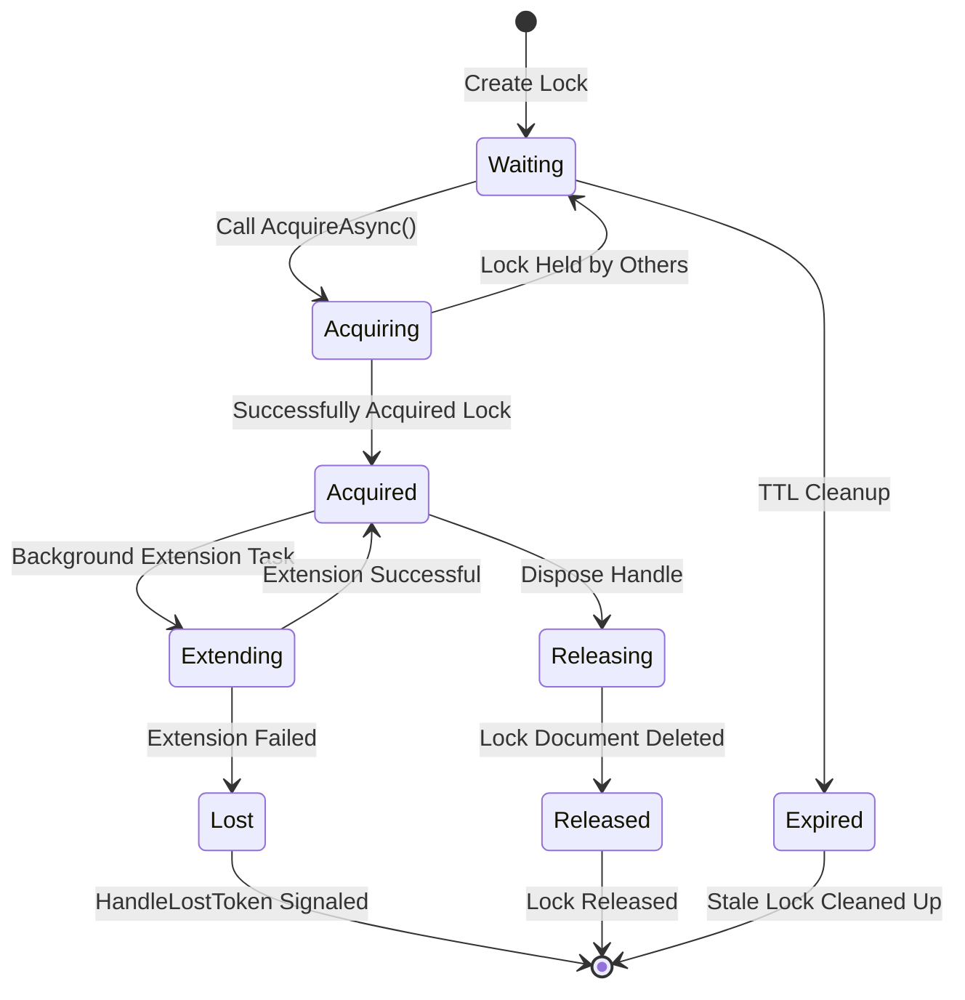
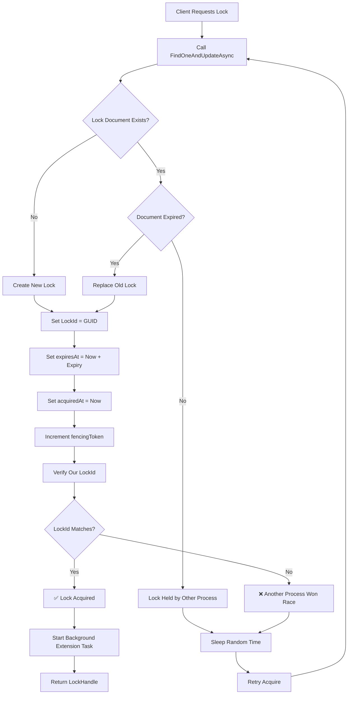
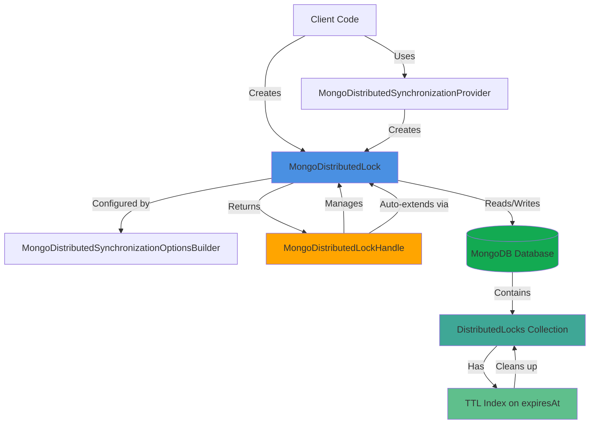
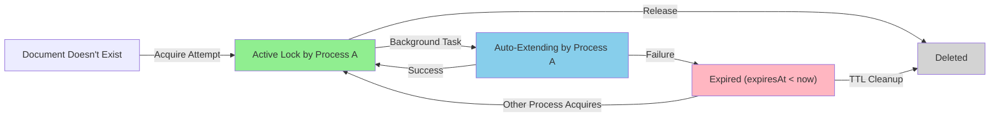
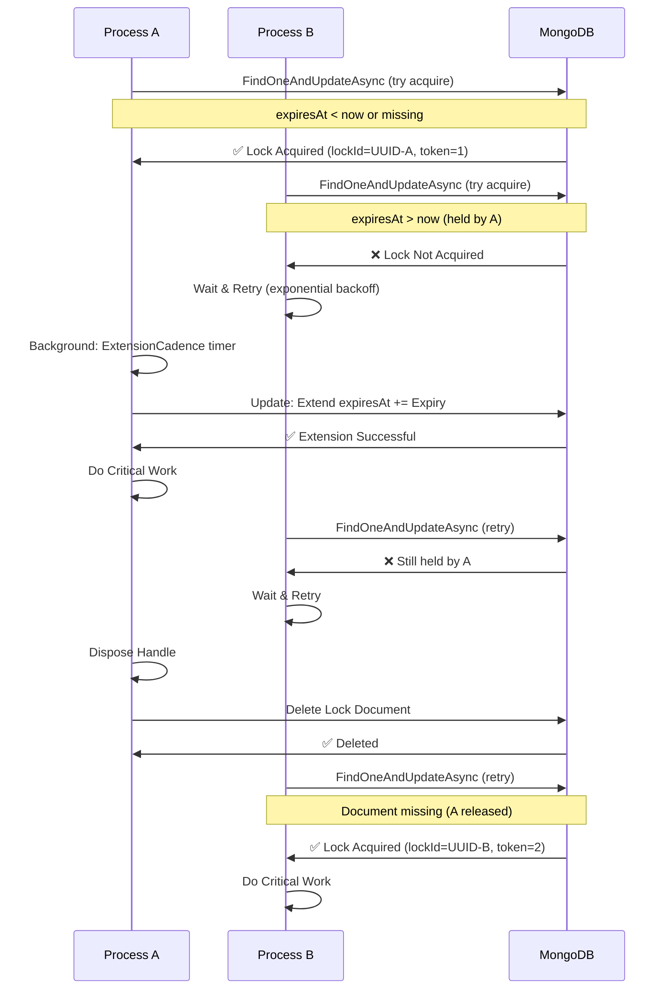
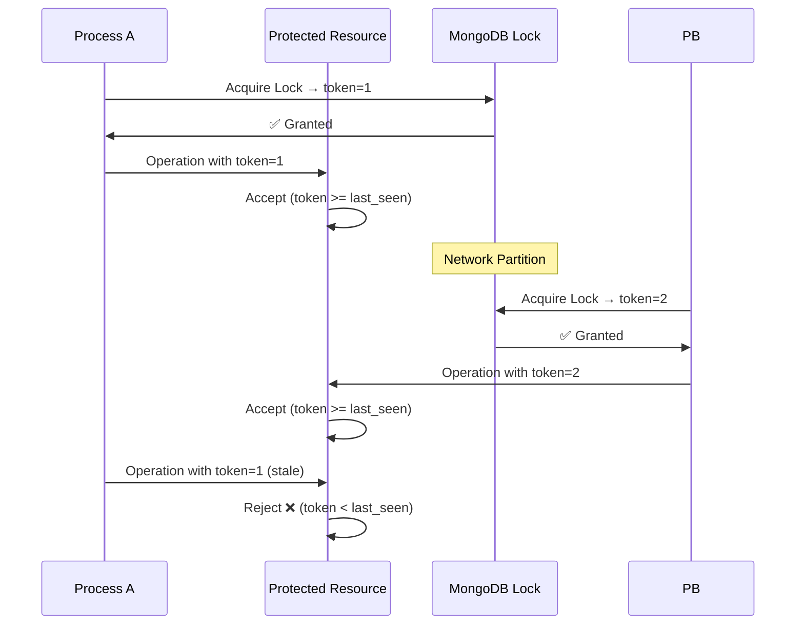
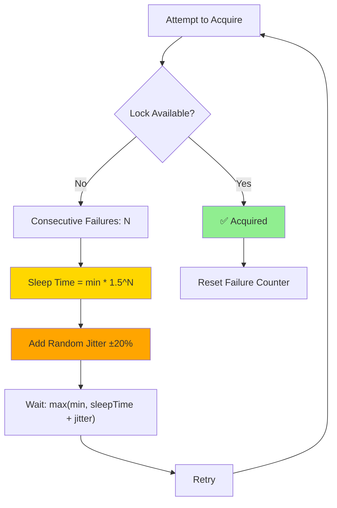

# DistributedLock.MongoDB

Provides distributed lock implementation using MongoDB as the backing store.

## Installation

```bash
dotnet add package DistributedLock.MongoDB
```

## APIs

- The `MongoDistributedLock` class implements the `IDistributedLock` interface.
- The `MongoDistributedSynchronizationProvider` class implements the `IDistributedLockProvider` interface.

## Basic Usage

### Creating and Acquiring a Lock

```csharp
using Medallion.Threading.MongoDB;
using MongoDB.Driver;

// Create MongoDB client and database
var client = new MongoClient("mongodb://localhost:27017");
var database = client.GetDatabase("myDatabase");

// Create a lock
var @lock = new MongoDistributedLock("myLockName", database);

// Acquire the lock
await using (var handle = await @lock.AcquireAsync())
{
    // Critical section protected by the lock
    Console.WriteLine("Lock acquired!");
}
// Lock is automatically released when disposed
```

### TryAcquire

While `AcquireAsync()` will block until the lock is available, there is also a `TryAcquireAsync()` variant which returns `null` if the lock could not be acquired:

```csharp
await using (var handle = await @lock.TryAcquireAsync())
{
    if (handle != null)
    {
        // Lock acquired successfully
    }
    else
    {
        // Someone else holds the lock
    }
}
```

### Using the Provider Pattern

For applications using dependency injection, the provider pattern makes it easy to separate lock configuration from its usage:

```csharp
using Medallion.Threading.MongoDB;
using MongoDB.Driver;

var client = new MongoClient("mongodb://localhost:27017");
var database = client.GetDatabase("myDatabase");

// Create a provider
var provider = new MongoDistributedSynchronizationProvider(database);

// Use the provider to create locks
var lock1 = provider.CreateLock("lock1");
var lock2 = provider.CreateLock("lock2");

await using (var handle = await lock1.AcquireAsync())
{
    // Do work...
}
```

### Configuration Options

You can customize the lock behavior using the options builder:

```csharp
var @lock = new MongoDistributedLock(
    "myLockName",
    database,
    options => options
        .Expiry(TimeSpan.FromSeconds(30))           // How long the lock lasts before expiring
        .ExtensionCadence(TimeSpan.FromSeconds(10)) // How often to extend the lock while held
        .BusyWaitSleepTime(                         // Sleep time between acquire attempts
            min: TimeSpan.FromMilliseconds(10),
            max: TimeSpan.FromMilliseconds(800))
        .UseAdaptiveBackoff(true)                   // Exponential backoff under high contention
);
```

#### Option Details

- **Expiry**: Determines how long the lock will be held before automatic expiration. Because of automatic extension, locks can be held for much longer than this value. Defaults to 30 seconds. This is important for crash recovery—if a process crashes while holding a lock, other processes will need to wait at most this long to acquire it.

- **ExtensionCadence**: How frequently the hold on the lock will be renewed to the full `Expiry` while the lock is actively held. Defaults to 1/3 of `Expiry` (approximately 10 seconds with default settings).

- **BusyWaitSleepTime**: Specifies the range of time the implementation will sleep between attempts to acquire a lock that is currently held by another process. A random value in the range is chosen for each attempt to prevent thundering herd problems. Defaults to 10ms minimum and 800ms maximum.

- **UseAdaptiveBackoff**: When enabled, uses exponential backoff instead of random sleep times under contention. This reduces MongoDB load during high contention periods while maintaining responsiveness when contention is low. Defaults to false.

### Custom Collection Name

By default, locks are stored in a collection named `"DistributedLocks"`. You can specify a custom collection name:

```csharp
// Direct lock creation with custom collection
var @lock = new MongoDistributedLock("myLockName", database, "MyCustomLocks");

// Provider with custom collection
var provider = new MongoDistributedSynchronizationProvider(database, "MyCustomLocks");
```

## Architecture & Design

### Lock Lifecycle Diagram



### Lock Acquisition Process



### Component Architecture



### Lock State Machine (Single Document in MongoDB)



## How It Works

MongoDB distributed locks use MongoDB's atomic document operations to implement safe, distributed locking:

### Acquisition Algorithm

The lock acquisition uses a single `FindOneAndUpdateAsync` operation with an aggregation pipeline to atomically:

1. Check if the lock document exists and is expired
2. If expired or missing, acquire the lock by:
   - Setting a unique `lockId` (GUID)
   - Recording the `acquiredAt` timestamp
   - Setting the `expiresAt` time based on the configured expiry
   - Incrementing the `fencingToken` for ordering guarantees
3. If still held by another process, leave it unchanged

The fencing token ensures that even if a lock holder loses its connection, any operations it performs using that token will be safely rejected.

### Lock Maintenance

Once acquired, the lock is automatically extended in the background at the configured `ExtensionCadence` to prevent premature expiration while the process is still running.

### Release

The lock is released by deleting the lock document when the handle is disposed.

### Stale Lock Cleanup

A TTL (Time-To-Live) index on the `expiresAt` field ensures MongoDB automatically removes expired lock documents. This provides automatic cleanup of stale locks from crashed or disconnected processes without requiring manual intervention.

## Features

- ✅ Async/await support with `async`/`await` and `await using`
- ✅ Automatic lock extension while held to prevent premature expiration
- ✅ Configurable expiry, extension cadence, and wait behavior
- ✅ Crash recovery via automatic lock expiration
- ✅ `CancellationToken` support for cooperative cancellation
- ✅ `HandleLostToken` notifications for detecting connection loss or lock theft
- ✅ Fencing tokens for distributed safety guarantees
- ✅ Adaptive backoff strategy for high-contention scenarios
- ✅ Atomic operations prevent race conditions
- ✅ Multi-framework support: .NET Standard 2.1, .NET 8, .NET Framework 4.7.2

## Multi-Process Lock Interaction

The following diagram shows how multiple processes interact with the same lock:



## Implementation Behaviors

### Lock Extension Failures

Lock extension happens automatically in the background at the specified `ExtensionCadence`. If extension fails (due to network issues, MongoDB connectivity problems, or the lock being stolen), the `HandleLostToken` will be signaled. Always monitor this token in critical sections:

```csharp
await using (var handle = await @lock.AcquireAsync())
{
    // Monitor for lock loss
    var lostTokenTask = handle.HandleLostToken;

    // Do work with timeout
    var completedTask = await Task.WhenAny(
        lostTokenTask,
        DoWorkAsync());

    if (completedTask == lostTokenTask)
    {
        // Lock was lost!
        throw new InvalidOperationException("Lock was lost during operation");
    }
}
```

### Lock Collection Management

The lock collection is automatically created on first use. A TTL index is created on the `expiresAt` field with the configuration:

- **Index Name**: `expiresAt_ttl`
- **Behavior**: MongoDB automatically removes documents once `expiresAt < now`

This index is created at most once per process per (database, collection) pair. Errors during index creation do not block lock acquisition.

### Timeout Support

All acquire methods support optional timeout parameters:

```csharp
// Acquire with 5-second timeout
var handle = await @lock.AcquireAsync(TimeSpan.FromSeconds(5));

// TryAcquire with 5-second timeout (returns null on timeout)
var handle = await @lock.TryAcquireAsync(TimeSpan.FromSeconds(5));
```

## Safety Guarantees

- **Atomicity**: Lock acquisition, extension, and release use atomic MongoDB operations
- **Fencing**: Fencing tokens prevent operations from processes that lost their locks
- **Crash Recovery**: Automatic expiration ensures locks are eventually released even if the holder crashes
- **No Thundering Herd**: Random and adaptive backoff prevents synchronized clients from overwhelming the database

### Fencing Token Mechanism

The fencing token ensures that even if a process loses its lock (due to network partition, crash, or timeout), it cannot perform operations on protected resources:



This mechanism prevents the "split brain" scenario where two processes both believe they hold the lock.

## Performance Considerations

- Lock acquisition requires 1-2 MongoDB operations (1 for acquisition, potentially 1 for index creation on first use)
- Lock extension happens in the background at `ExtensionCadence` intervals
- Under contention, adaptive backoff reduces the load on MongoDB compared to fixed random intervals
- The `expiresAt` TTL index keeps the collection clean without manual maintenance

## Adaptive Backoff Strategy

When contention is high, the adaptive backoff strategy exponentially increases the wait time between acquisition attempts:



### Backoff Comparison Chart

#### Low Contention Scenario

| Attempt # | Strategy | Sleep Duration | Notes              |
| --------- | -------- | -------------- | ------------------ |
| 1st       | Random   | 234ms          | Unpredictable      |
| 2nd       | Random   | 567ms          | Unpredictable      |
| 3rd       | Random   | 45ms           | Unpredictable      |
| 4th       | Random   | 689ms          | Unpredictable      |
| 1st       | Adaptive | 10ms           | Responsive         |
| 2nd       | Adaptive | 15ms           | Exponential growth |
| 3rd       | Adaptive | 22ms           | Controlled backoff |
| 4th       | Adaptive | 33ms           | Still responsive   |

#### High Contention Scenario

| Attempt # | Strategy | Sleep Duration | Impact                     |
| --------- | -------- | -------------- | -------------------------- |
| 1st       | Random   | 234ms          | Constant high load         |
| 2nd       | Random   | 567ms          | Constant high load         |
| 3rd       | Random   | 45ms           | Constant high load         |
| 4th       | Random   | 689ms          | Constant high load         |
| 1st       | Adaptive | 10ms           | Starts responsive          |
| 2nd       | Adaptive | 15ms           | Progressive backoff        |
| 3rd       | Adaptive | 22ms           | Reduces MongoDB load       |
| 4th       | Adaptive | 150ms          | Significantly reduces load |

**Key Advantage**: Adaptive backoff automatically adjusts to contention level, providing better resource utilization

## Framework Support

- **.NET Standard 2.1** and higher
- **.NET 8** and higher
- **.NET Framework 4.7.2** and higher

## Notes

- The lock collection will have an index on the `expiresAt` field for efficient queries
- Lock extension happens automatically in the background
- If lock extension fails, the `HandleLostToken` will be signaled
- Stale locks (from crashed processes) will automatically expire based on the expiry setting
