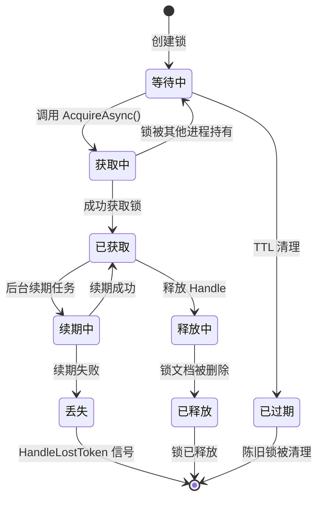
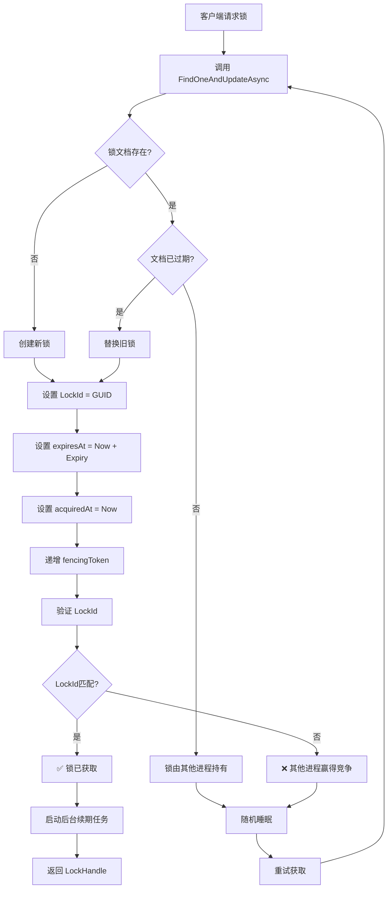
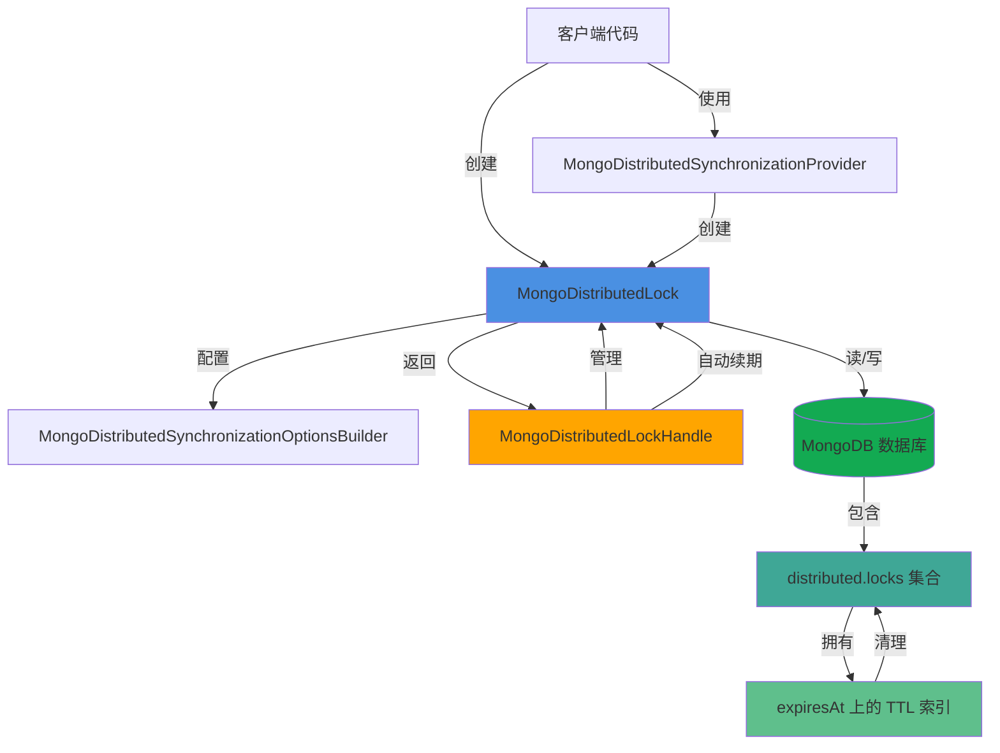
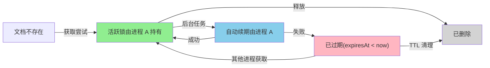
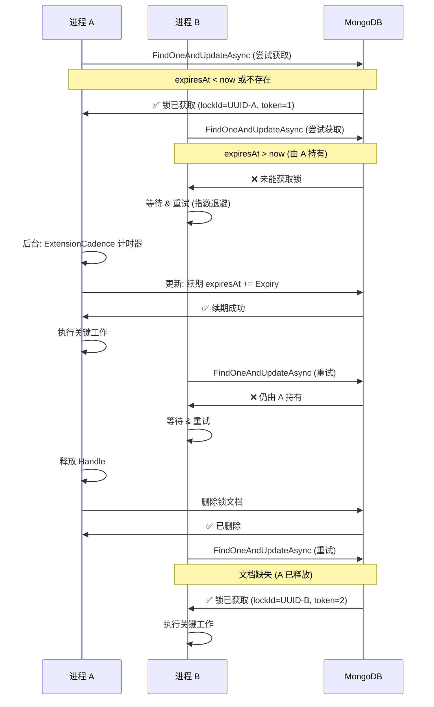
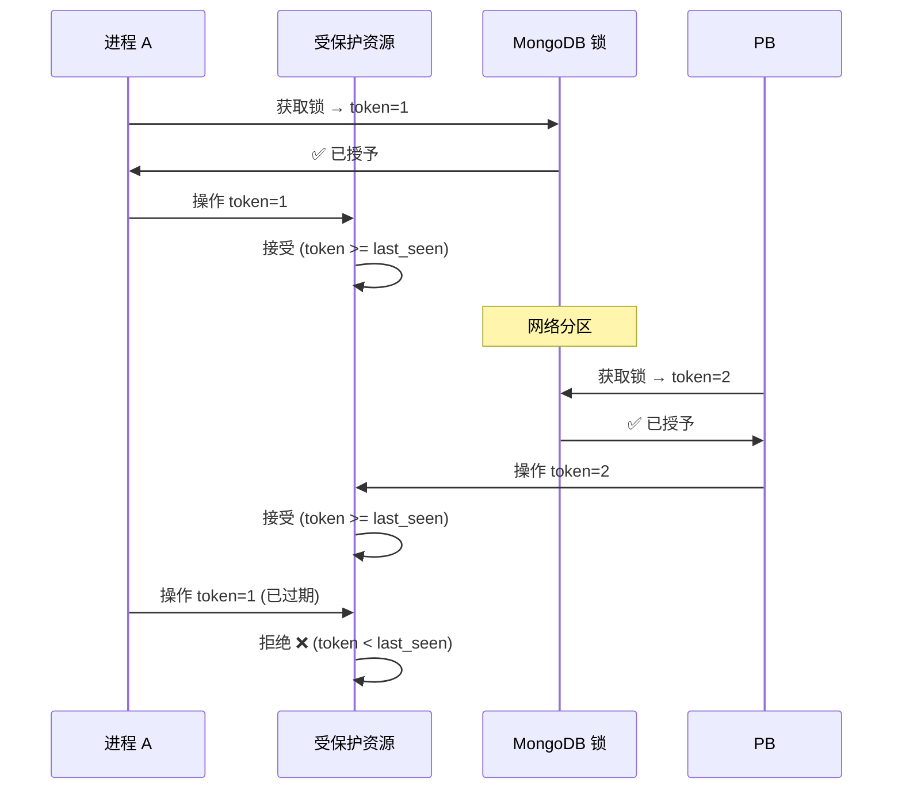
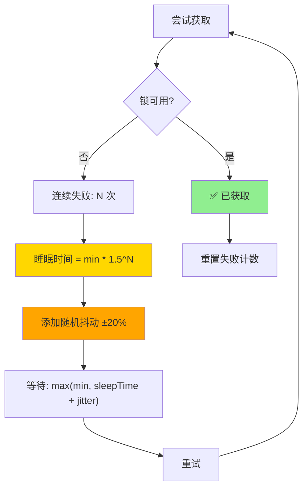

# DistributedLock.MongoDB

基于 MongoDB 的分布式锁实现。

## 安装

```bash
dotnet add package DistributedLock.MongoDB
```

## 接口

- `MongoDistributedLock` 类实现了 `IDistributedLock` 接口。
- `MongoDistributedSynchronizationProvider` 类实现了 `IDistributedLockProvider` 接口。

## 基本用法

### 创建并获取锁

```csharp
using Medallion.Threading.MongoDB;
using MongoDB.Driver;

// 创建 MongoDB 客户端和数据库
var client = new MongoClient("mongodb://localhost:27017");
var database = client.GetDatabase("myDatabase");

// 创建锁
var @lock = new MongoDistributedLock("myLockName", database);

// 获取锁
await using (var handle = await @lock.AcquireAsync())
{
    // 受锁保护的关键代码段
    Console.WriteLine("已获取锁!");
}
// 释放锁
```

### TryAcquire（尝试获取）

`AcquireAsync()` 会一直阻塞直到获取锁，而 `TryAcquireAsync()` 则会在无法获取锁时返回 `null`：

```csharp
await using (var handle = await @lock.TryAcquireAsync())
{
    if (handle != null)
    {
        // 成功获取锁
    }
    else
    {
        // 其他进程持有锁
    }
}
```

### 使用提供者模式

对于使用依赖注入的应用，提供者模式使得锁配置与使用分离变得容易：

```csharp
using Medallion.Threading.MongoDB;
using MongoDB.Driver;

var client = new MongoClient("mongodb://localhost:27017");
var database = client.GetDatabase("myDatabase");

// 创建提供者
var provider = new MongoDistributedSynchronizationProvider(database);

// 使用提供者创建不同名称的锁
var lock1 = provider.CreateLock("lock1");
var lock2 = provider.CreateLock("lock2");

await using (var handle = await lock1.AcquireAsync())
{
    // 使用 lock1 进行工作...
}
```

### 配置选项

您可以使用选项构建器自定义锁的行为：

```csharp
var @lock = new MongoDistributedLock(
    "myLockName",
    database,
    options => options
        .Expiry(TimeSpan.FromSeconds(30))           // 锁过期前的持续时间
        .ExtensionCadence(TimeSpan.FromSeconds(10)) // 持有时自动续期的频率
        .BusyWaitSleepTime(                         // 获取尝试之间的睡眠时间
            min: TimeSpan.FromMilliseconds(10),
            max: TimeSpan.FromMilliseconds(800))
        .UseAdaptiveBackoff(true)                   // 高竞争下的指数退避
);
```

#### 选项详解

- **Expiry（过期时间）**：确定锁在自动过期前将被持有多长时间。由于自动续期的存在，锁可以被持有远比这个值更长的时间。默认为 30 秒。这对于崩溃恢复很重要——如果进程在持有锁时崩溃，其他进程最多需要等待这么长时间才能获取锁。

- **ExtensionCadence（续期节奏）**：当锁被主动持有时，将锁的保持时间续期到完整的 `Expiry` 的频率。默认为 `Expiry` 的 1/3（使用默认设置时约 10 秒）。

- **BusyWaitSleepTime（忙等待睡眠时间）**：指定实现在尝试获取当前由另一个进程持有的锁时，将在两次尝试之间睡眠的时间范围。每次尝试都会从范围内随机选择一个值，以防止"羊群效应"问题。默认最小 10ms，最大 800ms。

- **UseAdaptiveBackoff（自适应退避）**：启用后，在竞争时使用指数退避而非随机睡眠时间。这在高竞争期间减少了 MongoDB 负载，同时在竞争低时保持了响应性。默认为 false。

### 自定义集合名称

默认情况下，锁存储在名为 `"distributed.locks"` 的集合中。您可以指定自定义集合名称：

```csharp
// 直接创建锁并使用自定义集合
var @lock = new MongoDistributedLock("myLockName", database, "MyCustomLocks");

// 使用自定义集合的提供者
var provider = new MongoDistributedSynchronizationProvider(database, "MyCustomLocks");
```

## 架构与设计

### 锁生命周期图



### 锁获取流程



### 组件架构



### 锁状态机（MongoDB 中的单个文档）



## 工作原理

MongoDB 分布式锁使用 MongoDB 的原子文档操作来实现安全的分布式锁定：

### 获取算法

锁获取使用单个 `FindOneAndUpdateAsync` 操作和聚合管道来原子地：

1. 检查锁文档是否存在且是否已过期
2. 如果已过期或不存在，通过以下方式获取锁：
   - 设置唯一的 `lockId`（GUID）
   - 记录 `acquiredAt` 时间戳
   - 根据配置的过期时间设置 `expiresAt`
   - 递增 `fencingToken` 以获得排序保证
3. 如果仍由另一个进程持有，则保持不变

围栏令牌（fencing token）确保即使锁持有者失去连接，它执行的任何使用该令牌的操作都会被安全拒绝。

### 锁维护

获取后，锁会按照配置的 `ExtensionCadence` 在后台自动续期，以防止进程运行时过早过期。

### 释放

当处理被释放时，通过删除锁文档来释放锁。

### 陈旧锁清理

`expiresAt` 字段上的 TTL（生存时间）索引确保 MongoDB 自动删除已过期的锁文档。这提供了对来自崩溃或断开连接进程的陈旧锁的自动清理，无需手动干预。

## 特性

- ✅ 异步/等待支持（`async`/`await` 和 `await using`）
- ✅ 在持有时自动续期锁以防止过早过期
- ✅ 可配置的过期时间、续期节奏和等待行为
- ✅ 通过自动过期实现崩溃恢复
- ✅ `CancellationToken` 支持协作取消
- ✅ `HandleLostToken` 通知以检测连接丢失或锁被盗
- ✅ 围栏令牌提供分布式安全保证
- ✅ 高竞争场景的自适应退避策略
- ✅ 原子操作防止竞态条件
- ✅ 多框架支持：.NET Standard 2.1、.NET 8、.NET Framework 4.7.2

## 多进程锁交互

下图展示多个进程如何与同一个锁交互：



## 实现行为

### 锁续期失败

锁续期在后台按指定的 `ExtensionCadence` 自动进行。如果续期失败（由于网络问题、MongoDB 连接问题或锁被盗），`HandleLostToken` 将被触发。始终在关键代码段中监控此令牌：

```csharp
await using (var handle = await @lock.AcquireAsync())
{
    // 监控锁丢失
    var lostTokenTask = handle.HandleLostToken;

    // 进行工作，带有超时
    var completedTask = await Task.WhenAny(
        lostTokenTask,
        DoWorkAsync());

    if (completedTask == lostTokenTask)
    {
        // 锁丢失了！
        throw new InvalidOperationException("操作期间锁被丢失");
    }
}
```

### 锁集合管理

锁集合在首次使用时自动创建。在 `expiresAt` 字段上创建 TTL 索引，配置如下：

- **索引名称**：`expiresAt_ttl`
- **行为**：一旦 `expiresAt < now`，MongoDB 自动删除文档

此索引每个进程每个 (数据库, 集合) 对最多创建一次。索引创建期间的错误不会阻止锁获取。

### 超时支持

所有获取方法都支持可选的超时参数：

```csharp
// 获取锁并设置 5 秒超时
var handle = await @lock.AcquireAsync(TimeSpan.FromSeconds(5));

// TryAcquire 设置 5 秒超时（超时时返回 null）
var handle = await @lock.TryAcquireAsync(TimeSpan.FromSeconds(5));
```

## 安全保证

- **原子性**：锁获取、续期和释放使用原子 MongoDB 操作
- **围栏**：围栏令牌防止丢失锁的进程执行操作
- **崩溃恢复**：自动过期确保锁最终被释放，即使持有者崩溃
- **无羊群效应**：随机和自适应退避防止同步的客户端使 MongoDB 过载

### 围栏令牌机制

围栏令牌确保即使进程失去其锁（由于网络分区、崩溃或超时），它也无法对受保护的资源执行操作：



这个机制防止了"脑裂"场景，即两个进程都认为它们持有锁。

## 性能考虑

- 锁获取需要 1-2 个 MongoDB 操作（1 个用于获取，首次使用时可能 1 个用于索引创建）
- 锁续期在后台按 `ExtensionCadence` 间隔进行
- 在竞争下，自适应退避相比固定随机间隔减少了对 MongoDB 的负载
- `expiresAt` TTL 索引保持集合整洁，无需手动维护

## 自适应退避策略

当竞争高时，自适应退避策略会指数级增加获取尝试之间的等待时间：



### 退避对比图

#### 低竞争场景

| 尝试次数 | 策略   | 睡眠时间 | 备注       |
| -------- | ------ | -------- | ---------- |
| 第 1 次  | 随机   | 234ms    | 不可预测   |
| 第 2 次  | 随机   | 567ms    | 不可预测   |
| 第 3 次  | 随机   | 45ms     | 不可预测   |
| 第 4 次  | 随机   | 689ms    | 不可预测   |
| 第 1 次  | 自适应 | 10ms     | 响应快     |
| 第 2 次  | 自适应 | 15ms     | 指数增长   |
| 第 3 次  | 自适应 | 22ms     | 控制退避   |
| 第 4 次  | 自适应 | 33ms     | 仍然响应快 |

#### 高竞争场景

| 尝试次数 | 策略   | 睡眠时间 | 影响              |
| -------- | ------ | -------- | ----------------- |
| 第 1 次  | 随机   | 234ms    | 恒定高负载        |
| 第 2 次  | 随机   | 567ms    | 恒定高负载        |
| 第 3 次  | 随机   | 45ms     | 恒定高负载        |
| 第 4 次  | 随机   | 689ms    | 恒定高负载        |
| 第 1 次  | 自适应 | 10ms     | 开始响应快        |
| 第 2 次  | 自适应 | 15ms     | 逐步退避          |
| 第 3 次  | 自适应 | 22ms     | 减少 MongoDB 负载 |
| 第 4 次  | 自适应 | 150ms    | 显著减少负载      |

**关键优势**：自适应退避根据竞争水平自动调整，提供更好的资源利用率

## 框架支持

- **.NET Standard 2.1** 及更高版本
- **.NET 8** 及更高版本
- **.NET Framework 4.7.2** 及更高版本

## 备注

- 锁集合将在 `expiresAt` 字段上有一个索引，用于高效查询
- 锁续期在后台自动进行
- 如果锁续期失败，`HandleLostToken` 将被触发
- 来自崩溃进程的陈旧锁将根据过期设置自动过期
